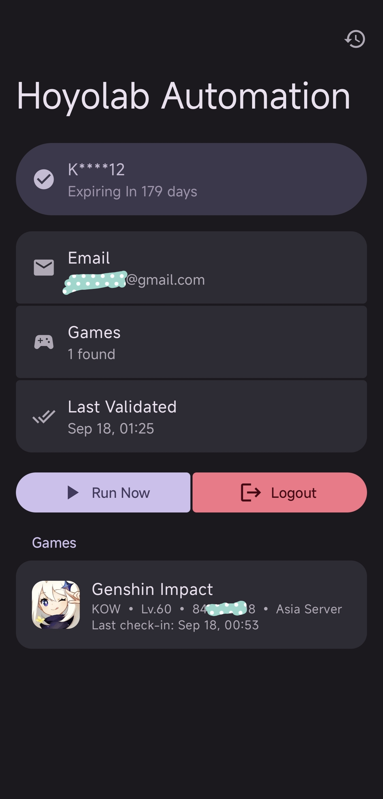

# [Hoyolab Automation](https://github.com/KOW-tools/HoyolabAutomation)

Hoyolab Automation is a free, open-source Android application that automates your daily HoYoLAB check-ins.

## Supported Games

- **Genshin Impact**
- **Honkai: Star Rail**
- **Zenless Zone Zero**
- **Honkai Impact 3rd**
- **Tears of Themis**

## Features

- **Automatic Daily Check-Ins**: Set it once and forget it - the app automatically checks in to all your games every day at midnight
- **Multi-Game Support**: Manage check-ins for all your HoYoverse games from a single app
- **Check-In History**: View complete logs of all check-ins with detailed status for each game
- **Notifications**: Get notified about your daily check-in results and any issues that need attention
- **Privacy Focused**: All processing happens on your device with no third-party data sharing
- **Open Source**: Fully transparent and community-driven

## Requirements

- Android device (Android 10 or higher)
- HoYoLAB account with linked games

## Screenshots

| Dashboard | History |
|---|---|
|  |  |

## How to Use

### First Time Setup

1. Download the latest release from [GitHub](https://github.com/KOW-tools/HoyolabAutomation/releases)
2. Install the APK on your Android device
3. Open the app and tap "Login"
4. Sign in with your HoYoLAB account credentials
5. The app will automatically detect your linked games and schedule daily check-ins

### Running Manual Check-In

1. Open the app
2. Tap the "Run Now" button
3. Wait for the check-in process to complete
4. Check the notification for results

### Viewing Check-In History

1. Open the app
2. Tap the logs icon in the top right corner
3. Browse your check-in history

## Notifications

The app sends notifications for:
- Successful check-ins with summary of all games
- Failed check-ins or errors
- Cookie expiration (when you need to login again)
- Network errors

## Privacy & Security

- Your login credentials are securely stored using Android's encrypted storage
- No data is sent to third-party servers
- Check-in logs are stored locally on your device and automatically pruned after 30 days

## Source Code

Open source on GitHub: [KOW-tools/HoyolabAutomation](https://github.com/KOW-tools/HoyolabAutomation)

Licensed under MIT License
