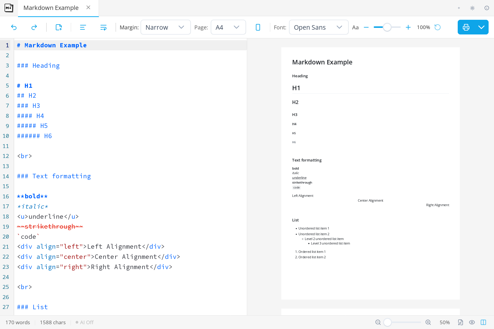
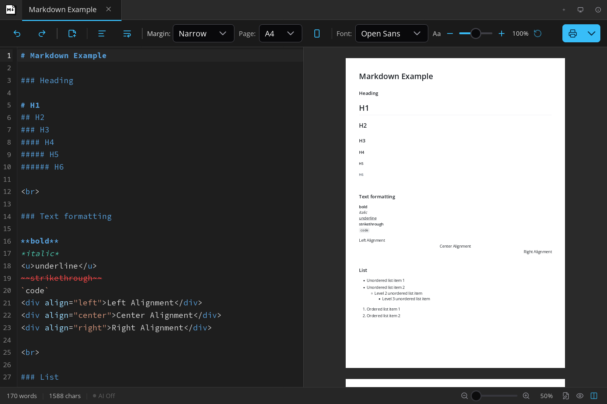
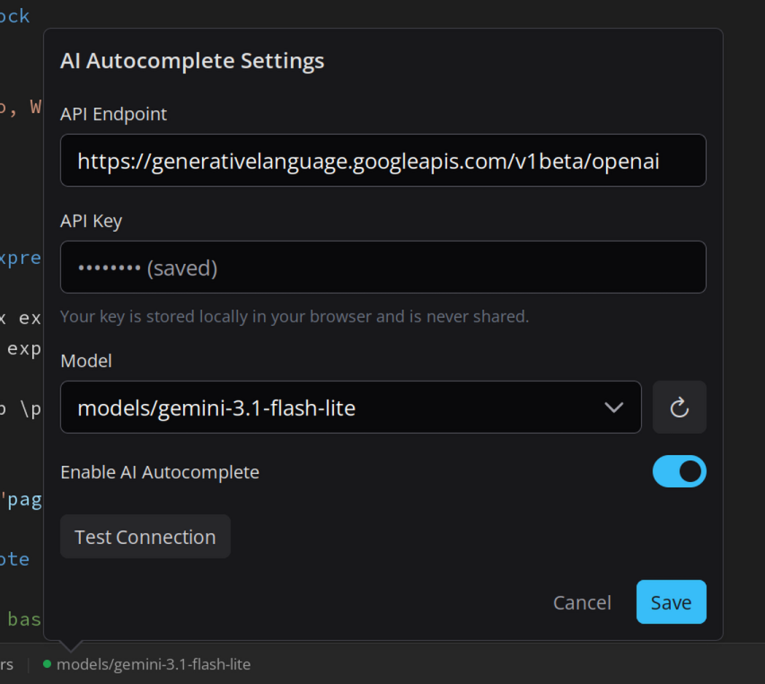
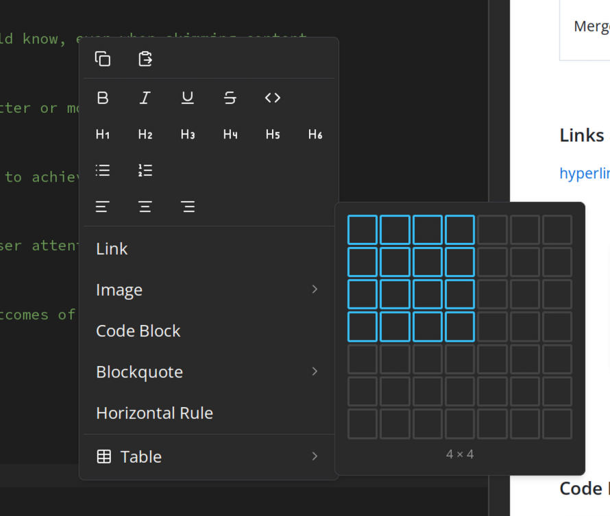
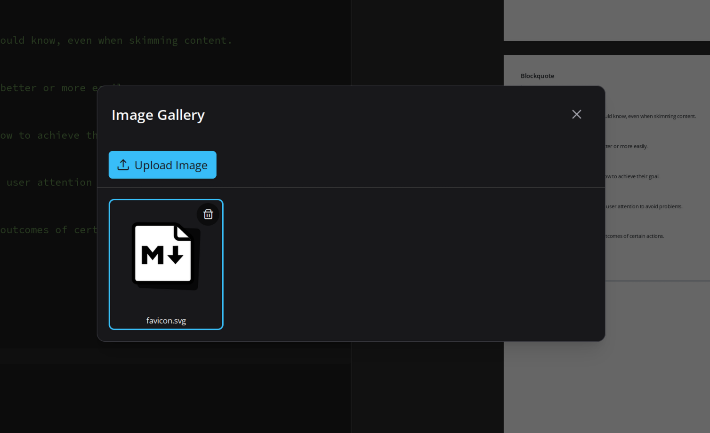

# [Markdown Printer](https://tools.kowx712.cc/markdown-printer/)

Markdown Printer is a free, open-source, **pure static** markdown editor and previewer. No backend, no databases — everything runs entirely in your browser, ensuring your content never leaves your machine.

## Features

- **Pure Static**: Zero server dependencies. Deploy anywhere — GitHub Pages, Netlify, or any static file host.
- **Instant Preview**: See your markdown rendered in real-time with live update as you type.
- **Print-Ready Output**: Optimized styles for printing and PDF export.
- **Syntax Highlighting**: Beautiful code blocks with language support across multiple themes.
- **LLM Integration**: Built-in autocomplete powered by your browser's local AI capabilities — write faster with intelligent suggestions.
- **Insert Table**: Quickly scaffold markdown tables without manual formatting.
- **Image Upload**: Paste or upload images directly into your markdown.
- **Dark & Light Mode**: Switch between themes to match your workflow.
- **Responsive Design**: Works seamlessly on desktop, tablet, and mobile.

## Snapshots

| Light Preview | Dark Preview |
|---|---|
|  |  |

| LLM Autocomplete | Insert Table | Image Upload |
|---|---|---|
|  |  |  |

## How to Use

1. Visit [tools.kowx712.cc/markdown-printer](https://tools.kowx712.cc/markdown-printer/)
2. Paste or type your markdown content
3. Preview the rendered output
4. Print or export your document

## Source Code

Open source on GitHub: [KOW-tools/markdown-printer](https://github.com/KOW-tools/markdown-printer)
