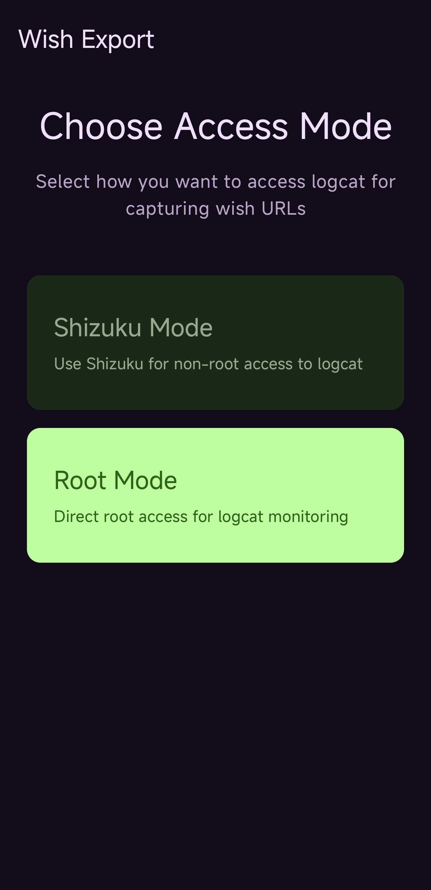
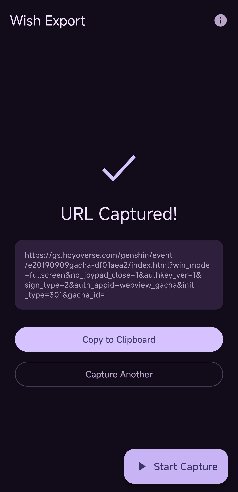

# [Wish Export](https://github.com/KOW-tools/wish-export)

Wish Export is a free, open-source Android application that exports wish history URLs from HoYoverse games directly from your device.

## Supported Games

- **Genshin Impact**: wish history URL
- **Honkai: Star Rail**: warp history URL  
- **Zenless Zone Zero**: signal search history URL

## Features

- **Direct Export**: Extract wish history URLs directly from game data on your Android device
- **Multiple Methods**: Supports both root access and Shizuku for non-root devices
- **Easy to Use**: Simple interface for quick URL extraction
- **Privacy Focused**: All processing happens on your device
- **Open Source**: Fully transparent and community-driven

## Requirements

- Android device with one of the supported games installed
- Either:
  - Root access
  - [Shizuku](https://shizuku.rikka.app/) installed and running

## Screenshots

| Select | Export |
|---|---|
|  |  |

## How to Use

1. Download the latest release from [GitHub](https://github.com/KOW-tools/wish-export/releases)
2. Install the APK on your Android device
3. Ensure you have root access or Shizuku running
4. Open the app and select your game
5. Grant necessary permissions
6. Export your wish history URL
7. Use the URL with wish history analyzers or trackers

## Source Code

Open source on GitHub: [KOW-tools/wish-export](https://github.com/KOW-tools/wish-export)

Licensed under MIT License
